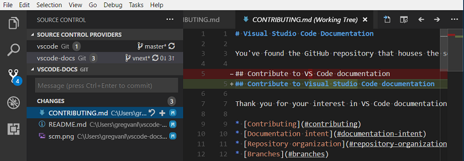

#Update IOS App

1. Apri Visual Studio Code

## Aggiorna il codice in locale

1. Vai nel menu laterale di sinistra e selezione la voce a forma di Y 'Version Control' 
2. Premi nei tre puntini nella voce 'SOURCE CONTROL' e richiedi un 'Pull'. (_hai aggiornato i file in locale_)

### Aggiorna la versione dell'App (se richiesto dal programmatore)

1. Nel menu laterale premi sulla prima icona 'File'
2. Nella lista centrale cerca ed apri pubspec.yaml
3. Cerca la voce 'version' a incrementa di uno la versione, ad esempio '1.0.8+5' -> '1.0.8+6'
4. Vai sul menu in alto 'File'->'Salva tutti i file'(o una roba simile)

## Testa l'app

Shift+P+CMD = Lista dei comandi per comodità CMD

1. Apri il CMD, digita/avvia 'Flutter: Launch Emulator' e seleziona ios se richiesto e attendi l'avvio dell'emulatore
2. Api il CMD, digita/avvia 'Start debugging' seleziona 'Flutter' se richiesto e il dispositivo ios
3. Controlla se l'applicazione funzione
4. Stoppa l'app dal menu in alto ad icone tramite il bottone quadrato rosso 

## Crea la Build

(_Se il terminale non è aperto vai sul menu in alto 'view'->'Terminal'_)

1. Nel menu in basso seleziona 'Terminal' e digita i seguinti comandi (**attendi che il precedente abbai finito**):
  - flutter clean
  - flutter build ios release

## Pubblica la build

1. Chiudi Visual Studio Code
2. Apri Xcode
3. Menu in alto 'Product'->'Archive'
4. Segui la procedura standard
5. Fai tutto ciò che devi fare

## Aggiorna il codice in cloud

1. Una volta finito tutto: Chiudi XCode
2. Apri Visual Studio Code
3. Vai sul menu di sinistra e premi sulla Y 'Version Control'
4. In 'Source Control' (**Attenti il completamento del comando, una decina di secondi):
  - **Commit All**: digita un messaggio tipo: 'build ios app 1.0.9+6' e premi invio
  - **Push**
  
## Hai finito!

Nei commenti della pubblicazione sul AppStore aggiungi quanto segue sennò te la rifiuteranno [fonte](https://stackoverflow.com/questions/55773206/flutter-appstore-rejection-for-contains-obfuscated-code-or-selector-mangling):
This app was entirely written in Objective-C to just meet the functionality documented in the App 'Description' section. There are no obfuscated code, selector mangling, or features meant to subvert the App Review process.

